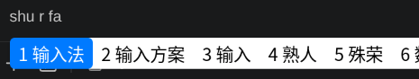

# kimpanel macOS Theme

解决 [gnome-shell-extension-kimpanel](https://github.com/wengxt/gnome-shell-extension-kimpanel) 候选框只有默认黑色样式，且 fcitx5 主题配置不生效的问题。将候选框渲染为 macOS 风格白色主题。



## 原因

fcitx5 有两个 UI 模块竞争渲染：

| 模块 | 优先级 | 作用 |
|------|--------|------|
| kimpanel | UIPriority=50 | 通过 DBus 把候选词发给 GNOME Shell 渲染 |
| classicui | UIPriority=0（默认） | fcitx5 自行渲染，使用 classicui.conf 主题 |

kimpanel 优先级更高，所以候选窗口实际由 GNOME Shell 的 `stylesheet.css` 控制，而不是 fcitx5 的主题配置。

## 安装

```bash
./install.sh
```

`install.sh` 只会覆盖扩展目录（`~/.local/share/gnome-shell/extensions/kimpanel@kde.org/`）中的以下文件，不会替换整个扩展：

- `stylesheet.css` — 候选框样式
- `panel.png` / `highlight.png` — 背景素材
- `org.gnome.shell.extensions.kimpanel.gschema.xml` — GSettings schema（修复扩展加载失败）

完成后注销重新登录即可。

## 定制

编辑 `stylesheet.css`，关键样式：

- 选中高亮色 → `.kimpanel-candidate-item:active` 的 `background-color`
- 面板圆角 → `.popup-menu-content.kimpanel-popup-content` 的 `border-radius`
- 间距 → `.kimpanel-candidate-item` 的 `padding` / `margin`
- 阴影 → `.popup-menu-content.kimpanel-popup-content` 的 `box-shadow`
